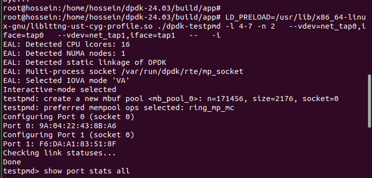
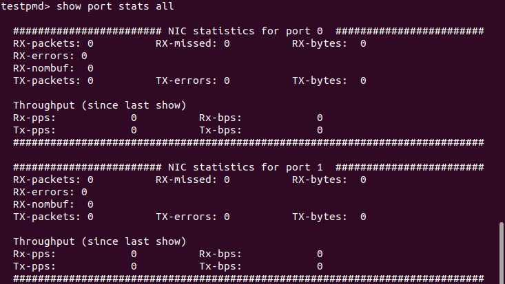

# TAP-Poll-Mode-Driver
This project is designed to analyze network performance using DPDK (testpmd), virtual TAP interfaces, and the tcpreplay tool. Below is the structured workflow for implementation and analysis:

## Installing and Building DPDK from Source with Function Tracing Support
1. **Download the Latest DPDK Version**
  
    Retrieve the latest release from the [official DPDK website](https://core.dpdk.org/download/)

<br>

2. **Extract the Archive**
    ```shell
    tar xJf dpdk-<version>.tar.xz
    cd dpdk-<version>
    ```
<br>

3. **Configure the Build Environment Using Meson**
    ```shell
    meson setup build \
    -Dexamples=all \
    -Dlibdir=lib \
    -Denable_trace_fp=true \
    -Dc_args="-finstrument-functions"
    ```
    > *The `-Dc_args="-finstrument-functions"` Meson configuration flag ensures that function entry and exit points are instrumented during compilation. This is essential for LTTng to capture user-space function traces; without it, the resulting trace data may be incomplete or empty.*

<br>

4. **Build and Install Using Ninja**
    ```shell
    cd build
    ninja
    meson install
    ldconfig
    ```
    > Note: Root privileges are required for the last two commands.
  
  <br>

  The compiled binaries will be located in the /build/app directory.

  <br>
  # configure hugepage and mount 1GB pagesize

```shell
echo 1024 > /sys/kernel/mm/hugepages/hugepages-2048kB/nr_hugepages
mkdir /mnt/huge
mount -t hugetlbfs pagesize=1GB /mnt/huge
```

# create two TAP interfaces for DPDK's TAP Poll Mode Driver (PMD)

in directory cd dpdk-24.03/build
to run testpmd

```shell
 sudo LD_PRELOAD=/usr/lib/x86_64-linux-gnu/liblttng-ust-cyg-profile.so ./app/dpdk-testpmd -l 0-1 --proc-type=primary --file-prefix=pmd1 --vdev=net_memif,role=server -- -i
 ```
 What this does:

1-Creates net_tap0 and net_tap1 virtual devices

 2-Assigns 2 CPU cores (-l 0-1)

3- Configures 2 TX/RX queues per port

4-Starts in interactive mode (-i)

***LD_PRELOAD=/usr/lib/x86_64-linux-gnu/liblttng-ust-cyg-profile.so forces the DPDK application to load LTTng's function tracing library first, enabling detailed profiling of function calls for performance analysis. This allows tracking exact timing and frequency of every function call in DPDK (like packet processing functions) to identify bottlenecks.

Here is what the terminal should look like:



then with show port stats all you can see the port stats



# create another queue rx/tx
tIn the next step, to add a new queue in TAP mode, we need to perform the following actions in testpmd: 
first, stop all ports, then create new RX and TX queues using the code below, and finally start the ports again.
[newtx-rx](newtx-rx.png)
then, after creating the second RX and TX queues, we can observe the results.
[showallport](showallport.png)

## create filter on testpmd

```shell
flow create 0 ingress pattern eth / ipv4 / udp / end actions queue index 0 / end
```
note:This command installs a flow rule on port 0 that matches Ethernet + IPv4 + UDP packets and sends them to queue 0.

# run tcp replay 
Then, we should clone tcpreplay from the https://github.com/appneta/tcpreplay/releases/tag/v4.5.1 to use it in our project.
After downloading tcpreplay-4.5.1.tar.gz and installing it, we open a new terminal and run the following code in the same terminal.
```shell
./configure --disable-tuntap
make
sudo make install
```
after that we  can run pcapfile that before create it by below command

```shell
tcpreplay -i tap0 --loop=1000 ./real_traffic.pcap 
```


### Setting Up an LTTng Trace Session
  In order to Automate the LTTng capture, create a shell script to configure the LTTng session. The script initializes the session, adds the necessary context fields, starts tracing, sleeps for a specified duration, and then stops and destroys the session.


        ```shell
        touch script.sh
        chmod +x script.sh
        nano script.sh
        ```
      Paste the following commands into the file:
      
 
#!/bin/bash
   ```shell
lttng create libpcap
lttng enable-channel --userspace --num-subbuf=4 --subbuf-size=40M channel0
#lttng enable-channel --userspace channel0
lttng enable-event --channel channel0 --userspace --all
lttng add-context --channel channel0 --userspace --type=vpid --type=vtid --type=procname
lttng start
sleep 2
lttng stop
lttng destroy
 ```
