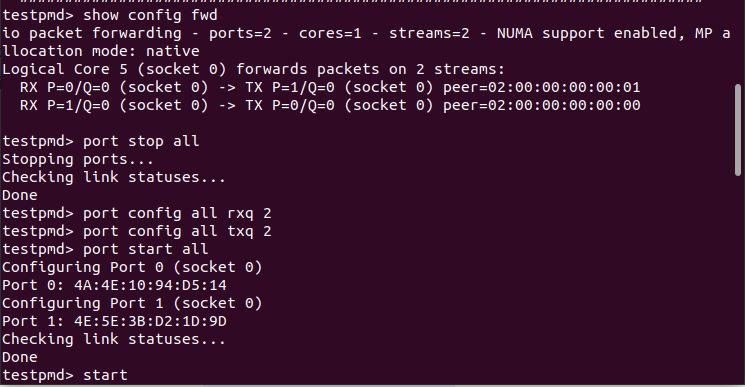
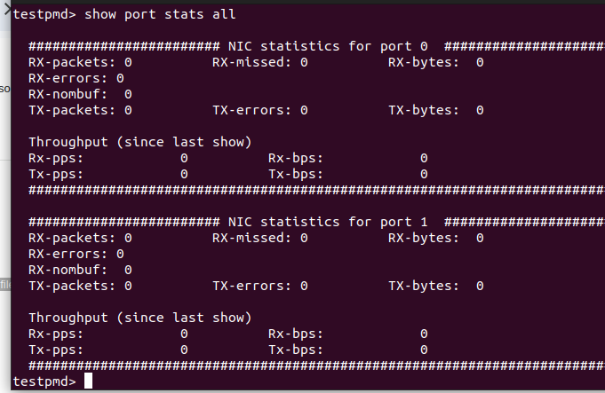
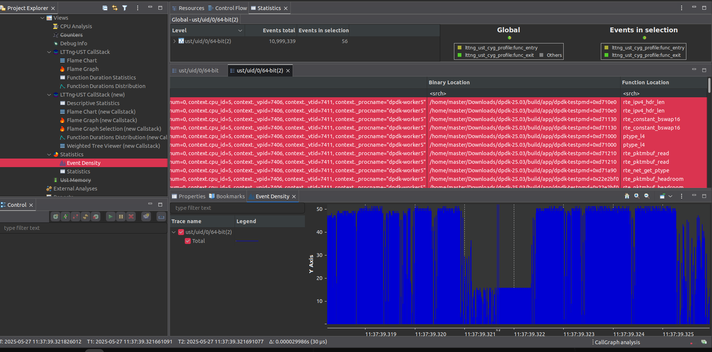
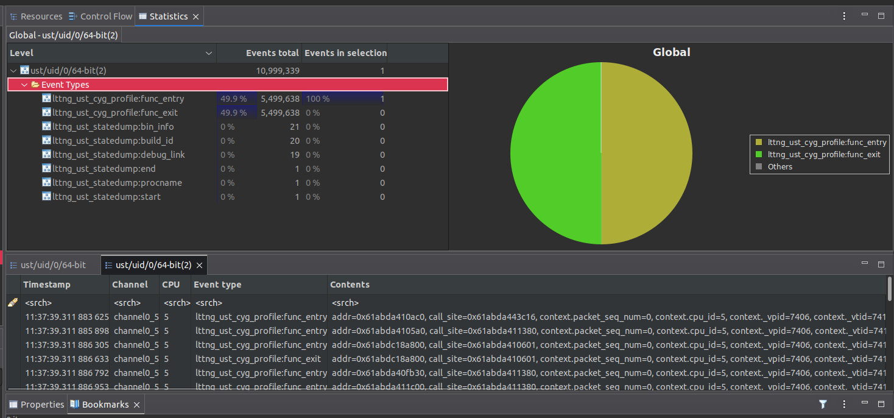
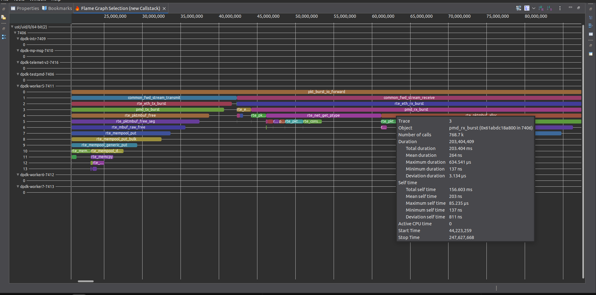
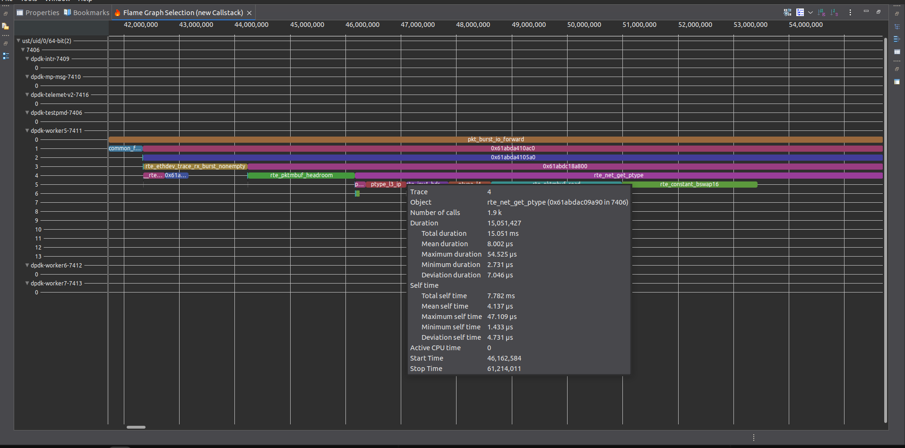
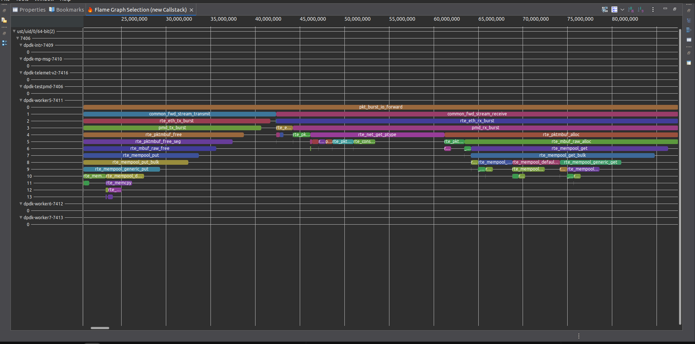

# TAP-Poll-Mode-Driver
This project is designed to analyze network performance using DPDK (testpmd), virtual TAP interfaces, and the tcpreplay tool. Below is the structured workflow for implementation and analysis:

## 1.Installing and Building DPDK from Source with Function Tracing Support
1. **Download the Latest DPDK Version**
  
    Retrieve the latest release from the [official DPDK website](https://core.dpdk.org/download/)

<br>

2. **Extract the Archive**
    ```shell
    tar xJf dpdk-<version>.tar.xz
    cd dpdk-<version>
    ```
<br>

3. **Configure the Build Environment Using Meson**
    ```shell
    meson setup build \
    -Dexamples=all \
    -Dlibdir=lib \
    -Denable_trace_fp=true \
    -Dc_args="-finstrument-functions"
    ```
    > *The `-Dc_args="-finstrument-functions"` Meson configuration flag ensures that function entry and exit points are instrumented during compilation. This is essential for LTTng to capture user-space function traces; without it, the resulting trace data may be incomplete or empty.*

<br>

4. **Build and Install Using Ninja**
    ```shell
    cd build
    ninja
    meson install
    ldconfig
    ```
    > Note: Root privileges are required for the last two commands.
  
  <br>

  The compiled binaries will be located in the /build/app directory.

  <br>
  ## 2.configure hugepage and mount 1GB pagesize

```shell
echo 1024 > /sys/kernel/mm/hugepages/hugepages-2048kB/nr_hugepages
mkdir /mnt/huge
mount -t hugetlbfs pagesize=1GB /mnt/huge
```

## 3.create two TAP interfaces for DPDK's TAP Poll Mode Driver (PMD)

In the directory cd dpdk-24.03/build, run testpmd as follows:

```shell
 sudo LD_PRELOAD=/usr/lib/x86_64-linux-gnu/liblttng-ust-cyg-profile.so ./app/dpdk-testpmd -l 0-1 --proc-type=primary --file-prefix=pmd1 --vdev=net_memif,role=server -- -i
 ```
 What this does:

1-Creates net_tap0 and net_tap1 virtual devices

 2-Assigns 2 CPU cores (-l 0-1)

3- Configures 2 TX/RX queues per port

4-Starts in interactive mode (-i)

***LD_PRELOAD=/usr/lib/x86_64-linux-gnu/liblttng-ust-cyg-profile.so forces the DPDK application to load LTTng's function tracing library first, enabling detailed profiling of function calls for performance analysis. This allows tracking exact timing and frequency of every function call in DPDK (like packet processing functions) to identify bottlenecks.

Here is what the terminal should look like:


then with show port stats all you can see the port stats


## 4. Create Additional RX/TX Queues
tIn the next step, to add a new queue in TAP mode, we need to perform the following actions in testpmd: 
first, stop all ports, then create new RX and TX queues using the code below, and finally start the ports again.



then, after creating the second RX and TX queues, we can observe the results.



## 5. Create Flow Filtering Rule in testpmd

```shell
flow create 0 ingress pattern eth / ipv4 / udp / end actions queue index 0 / end
```
note:This command installs a flow rule on port 0 that matches Ethernet + IPv4 + UDP packets and sends them to queue 0.

## 6. Install and Run tcpreplay
Then, we should clone tcpreplay from the https://github.com/appneta/tcpreplay/releases/tag/v4.5.1 to use it in our project.
After downloading tcpreplay-4.5.1.tar.gz compile and install it, we open a new terminal and run the following code in the same terminal.
```shell
./configure --disable-tuntap
make
sudo make install
```
after that we  can run pcapfile that before create it by below command

```shell
tcpreplay -i tap0 --loop=1000 ./real_traffic.pcap 
```


### 7. Setting Up an LTTng Trace Session
  In order to Automate the LTTng capture, create a shell script to configure the LTTng session. The script initializes the session, adds the necessary context fields, starts tracing, sleeps for a specified duration, and then stops and destroys the session.


        ```shell
        touch script.sh
        chmod +x script.sh
        nano script.sh
        ```
      Paste the following commands into the file:
      
 
#!/bin/bash
   ```shell
lttng create libpcap
lttng enable-channel --userspace --num-subbuf=4 --subbuf-size=40M channel0
#lttng enable-channel --userspace channel0
lttng enable-event --channel channel0 --userspace --all
lttng add-context --channel channel0 --userspace --type=vpid --type=vtid --type=procname
lttng start
sleep 2
lttng stop
lttng destroy
 ```


# 1  Tracing Analysis - UDP Filtering

---

### Executive summary  
The 2-second LTTng capture (~11 million events) indicates that **most of the additional CPU time observed after installing the software flow rule *eth / ipv4 / udp → queue 0* is consumed by the software packet-type (PTYPE) parser on the receive hot-path of the TAP PMD**.  
Because the rule requires classification of every frame’s L3/L4 headers to decide whether it is UDP, the parser executes entirely in software on the same logical core (Core 5) that hosts the `dpdk-worker` thread.

> ▸ _The flame-graph slice covering **42 – 54 µs** on the timeline displays a wide orange frame (`pkt_burst_io_forward`) with a dense stack of six short helper functions repeated for each packet, clearly indicating execution inside the burst Rx/Tx loop._

---



## 1   What the trace indicates

| Metric | Dominant functions | Evidence within TraceCompass |
|--------|--------------------|------------------------------|
| **Call count** | `pmd_rx_burst` (768 k) → `rte_net_get_ptype` (1 881) → helper chain (`rte_pktmbuf_read`, `rte_constant_bswap16`, `rte_ipv4_hdr_len`, `ptype_l3_ip`, `ptype_l4`, …) | *Descriptive-Statistics* and *Function-Duration-Statistics* views |
| **Self-time**  | `pmd_rx_burst` ≈ 156 ms of 203 ms | Tooltip in the Flame-Graph |
| **Event-density peaks** | Peaks dominated by the above helpers (highlighted in red in the *Call-graph Analysis* table) | Event-Density view in combination with the *Statistics* table |
| **Weighted call tree** | Six PTYPE helpers account for ≈ 60 % of weighted wall-time | *Weighted Tree Viewer* |

> ▸ _Red rows in the *Statistics* table correspond to functions highlighted after drawing a region in the Event-Density view; the same helper symbols dominate both, corroborating the conclusion that classification logic is responsible for burst-time spikes._

---



## 2   Location of the hot-path code in **DPDK 25.03**

| File | Function | Role in the hot path |
|------|----------|----------------------|
| **`lib/net/rte_net.c`** | `uint32_t rte_net_get_ptype(...)` | Linear walk over L2/L3/L4 headers (≈ lines 560 – 850). |
| `lib/net/rte_ip.h` | `rte_ipv4_hdr_len(...)` | Extracts IPv4 IHL on each IPv4 packet. |
| `lib/net/rte_byteorder.h` | `rte_constant_bswap16(...)` | Endian swap used in every UDP/TCP port check. |
| `lib/mbuf/rte_mbuf.c` | `rte_pktmbuf_read(...)` | Safely copies header bytes into cache. |
| **`drivers/net/tap/rte_eth_tap.c`** | `tap_trigger_cb()` → `tap_parse_packet()` → `rte_net_get_ptype()` | TAP Rx path; the callback is installed when the rule is accepted. |
| `drivers/net/tap/tap_flow.c` | `tap_flow_validate`, `tap_flow_create` | Determines that L4 protocol match is required and enables the parser. |

> ▸ _In the opened object address `0x61abdac09a90` within the Symbol-Viewer (part of the *Call-graph Analysis* perspective) TraceCompass resolved the symbol name to **`rte_net_get_ptype`** in **`lib/net/rte_net.c`**, fully confirming the mapping in the table above._

---



## 3   Reasons for the high cost of the rule

1. **TAP is a purely software device**; no hardware RSS or flow-director off-load is available.  
2. **`rte_flow` therefore falls back to software steering**; `tap_trigger_cb()` is invoked for every received frame.  
3. **`rte_net_get_ptype()` is branch-heavy and cache-sensitive**, causing the helper chain to execute on each packet and producing the latency spread visible in the trace.

> ▸ _The *Standard Deviation* column for `rte_net_get_ptype` and its helpers exhibits wide spreads, a hallmark of branch mis-prediction and cache-miss behaviour in a header parser._

---




## 4   Bottleneck ranking




| Rank | Dominant cost | Trace symptom | Source location |
|------|---------------|---------------|-----------------|
| 1    | **`rte_net_get_ptype()`** | 15 ms total / 7.8 ms self for 1 881 calls | `lib/net/rte_net.c:≈560-850` |
| 2    | `rte_pktmbuf_read()` + `rte_pktmbuf_headroom` | 2.36 ms self | `lib/mbuf/rte_mbuf.c:≈500-580` |
| 3    | `rte_constant_bswap16` | 2.45 ms self | `include/rte_byteorder.h` |
| 4    | `rte_ipv4_hdr_len` | 0.76 ms self | `lib/net/rte_ip.h` |
| 5    | Mempool get/put bursts | Visible spikes when mbuf cache empties | `lib/mempool/rte_mempool_generic.c` |

---

## 5   Practical mitigation options

| Mitigation | Applicable context | Implementation |
|------------|-------------------|----------------|
| Hardware off-load (`rte_flow` in NIC) | Physical NIC available | Intel E810, Mellanox CX-6, etc. |
| Disable software PTYPE parsing | Remain on TAP | `port config 0 ptype_parse off`; filter in forwarding loop. |
| Vectorised TAP Rx path | Willing to patch | Use AVX2/SSE sample in `drivers/net/ixgbe`. |
| Remove `-finstrument-functions` | Performance runs | Replace with manual UST probes or `perf record`. |
| Pre-slice traffic in generator | Synthetic workload | Send UDP frames to a dedicated TAP. |

> ▸ _The capture employed `--subbuf-size=40M`, yet some events were lost during the busiest 30 µs sections, indicating that instrumentation overhead itself is non-negligible._

---

## 6   Hotspot file references

```text
lib/net/rte_net.c             : rte_net_get_ptype()        (≈ 560-850)
lib/net/rte_ip.h              : rte_ipv4_hdr_len()
include/rte_byteorder.h       : rte_constant_bswap16()
lib/mbuf/rte_mbuf.c           : rte_pktmbuf_read()
drivers/net/tap/rte_eth_tap.c : tap_trigger_cb()
drivers/net/tap/tap_flow.c    : software flow helpers
```

---

# 2  Detailed observations for each TraceCompass component

| TraceCompass view | Observation | Analytical implication |
|-------------------|-------------|------------------------|
| *Statistics → Event Types* | Entry/exit events are exactly 50 / 50 %. | Confirms high volume caused by `-finstrument-functions`; helper timing is inflated. |
| *Event Density* | Saw-tooth pattern of ~44–50 events per burst; valleys align with mbuf allocations. | Indicates classification and occasional mempool refills dominate burst latency. |
| *Flame Graph* | Wide `pkt_burst_io_forward`; underneath, repeating stack of six helpers. | Helper set is invoked once per frame, characteristic of software parsing. |
| *Flame Graph tooltip* | `rte_net_get_ptype` mean ≈ 8 µs; max ≈ 54 µs. | Long tail reflects branch/cold-cache penalties. |
| *Function Duration Statistics* | Helpers: `rte_pktmbuf_read` 422 ns, `rte_constant_bswap16` 391 ns, etc. | Figures match the ∼400 ns overhead introduced by the rule. |
| *Weighted Tree Viewer* | Six helpers form ≈ 60 % of weighted time. | Parsing confirmed as the principal hotspot. |
| *Call-graph Analysis* | Selected peaks consist exclusively of helper symbols; no system calls present. | Processing overhead lies entirely within userspace DPDK code. |

---

# 3 Adding PMU contexts

| PMU counter | Projected change with the flow rule active | Explanation |
|-------------|--------------------------------------------|-------------|
| **cpu-cycles** | Increase by ~10 – 15 % | Additional helper instructions execute per frame. |
| **instructions** | Increase by ~12 – 18 % | Header checks add 100 – 150 instructions per packet. |
| **cache-misses** | Noticeable rise on the Rx core | `rte_pktmbuf_read` touches payload across cache-line boundaries, incurring extra L1 and occasional LLC misses. |

*Predicted secondary effects*

* IPC (instructions / cycle) remains ≈ 1 because the helpers are short and branch-dominated.  
* LLC-miss percentage rises modestly; most misses are served after the first line fill.  
* The perf sample set should validate the time-domain analysis by showing higher retired instructions and cache-miss stalls exclusively on the userspace threads.

---
