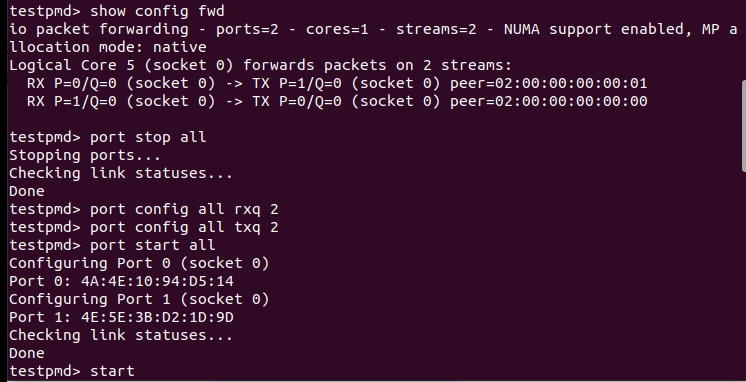
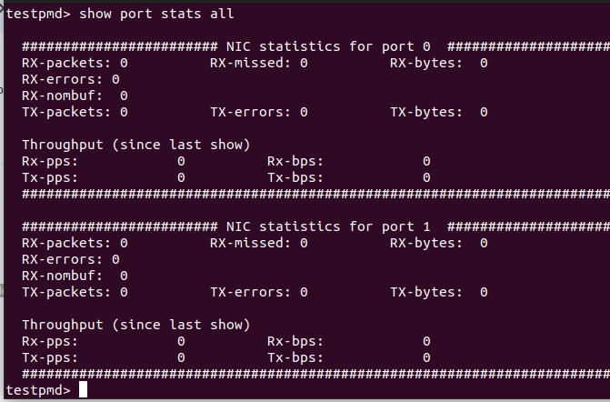

# TAP-Poll-Mode-Driver
This project is designed to analyze network performance using DPDK (testpmd), virtual TAP interfaces, and the tcpreplay tool. Below is the structured workflow for implementation and analysis:

## Installing and Building DPDK from Source with Function Tracing Support
1. **Download the Latest DPDK Version**
  
    Retrieve the latest release from the [official DPDK website](https://core.dpdk.org/download/)

<br>

2. **Extract the Archive**
    ```shell
    tar xJf dpdk-<version>.tar.xz
    cd dpdk-<version>
    ```
<br>

3. **Configure the Build Environment Using Meson**
    ```shell
    meson setup build \
    -Dexamples=all \
    -Dlibdir=lib \
    -Denable_trace_fp=true \
    -Dc_args="-finstrument-functions"
    ```
    > *The `-Dc_args="-finstrument-functions"` Meson configuration flag ensures that function entry and exit points are instrumented during compilation. This is essential for LTTng to capture user-space function traces; without it, the resulting trace data may be incomplete or empty.*

<br>

4. **Build and Install Using Ninja**
    ```shell
    cd build
    ninja
    meson install
    ldconfig
    ```
    > Note: Root privileges are required for the last two commands.
  
  <br>

  The compiled binaries will be located in the /build/app directory.

  <br>
  # configure hugepage and mount 1GB pagesize

```shell
echo 1024 > /sys/kernel/mm/hugepages/hugepages-2048kB/nr_hugepages
mkdir /mnt/huge
mount -t hugetlbfs pagesize=1GB /mnt/huge
```
#to create two TAP interfaces for DPDK's TAP Poll Mode Driver (PMD)

in directory cd dpdk-24.03/build
to run testpmd

```shell
 sudo LD_PRELOAD=/usr/lib/x86_64-linux-gnu/liblttng-ust-cyg-profile.so ./app/dpdk-testpmd -l 0-1 --proc-type=primary --file-prefix=pmd1 --vdev=net_memif,role=server -- -i
 ```
 What this does:

1-Creates net_tap0 and net_tap1 virtual devices

 2-Assigns 2 CPU cores (-l 0-1)

3- Configures 2 TX/RX queues per port

4-Starts in interactive mode (-i)

***LD_PRELOAD=/usr/lib/x86_64-linux-gnu/liblttng-ust-cyg-profile.so forces the DPDK application to load LTTng's function tracing library first, enabling detailed profiling of function calls for performance analysis. This allows tracking exact timing and frequency of every function call in DPDK (like packet processing functions) to identify bottlenecks.

Here is what the terminal should look like:


then with show port stats all you can see the port stats


next step to add new queue in tap mode we should do this step in test pmd
first stop all port and create new rx and tx with below code and start again
```shell
port stop all

port config all rxq 2

port config all txq 2
```
Here is what the terminal should look like:


then after create second rx and tx we can see 





then we should clone tcpreply from this source to do our project [official website](https://github.com/appneta/tcpreplay/releases/tag/v4.5.1)
after download tcpreplay-4.5.1.tar.gz and install it we open it in new terminall then in same terminal wirite below code

```shell
 ./configure --disable-tuntap
make
sudo make install
```

<br>

**Why This Approach?**

<br>**Avoids Conflicts**
project uses DPDK's high-performance TAP PMD
Disabling tcpreplay's built-in TUN/TAP prevents driver/functionality clashes

<br>**Optimized Setup**
Removes redundant TAP code → smaller, faster binary
Maintains clean separation: DPDK handles TAP, tcpreplay handles packet replayStability
Official v4.5.1 source ensures compatibility with modern systems
Bypasses outdated/incomplete OS package versions

khnow before put the pcap file in tcpreply we do filter flow in udp or tcp in testpmd 
```shell
flow create 0 ingress pattern eth / ipv4 / udp / end actions queue index 0 / end
```
then active tcpleply for pcapfile like below

```shell
tcpreplay -i tap0 --loop=10000 ./real_traffic.pcap
```
becarfull that pcapfile exsist in tcpreplay forder or get directory to run pcapfile before run tcpteplay we open wireshark in new terminal and capture tap1 to see packet that transfer from tap0 

![tcpreply(tcpreply.png)

![wireshark(wireshark.png)


